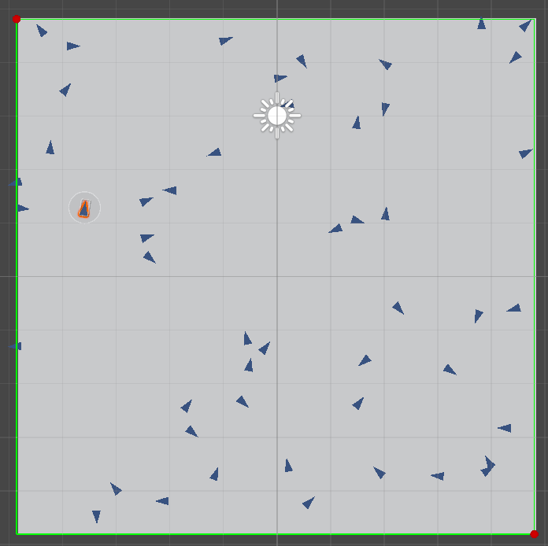
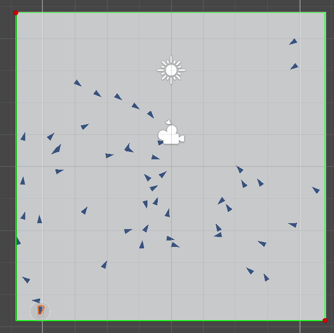
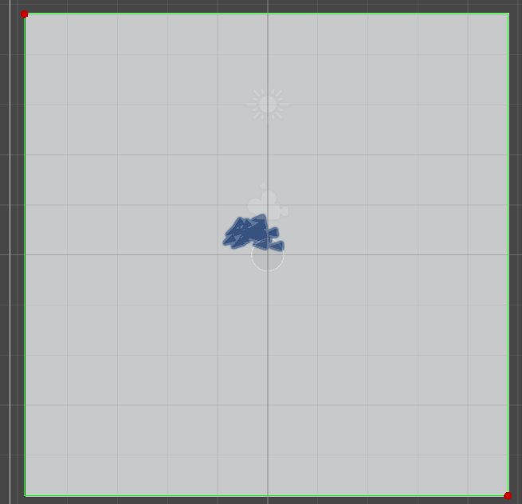
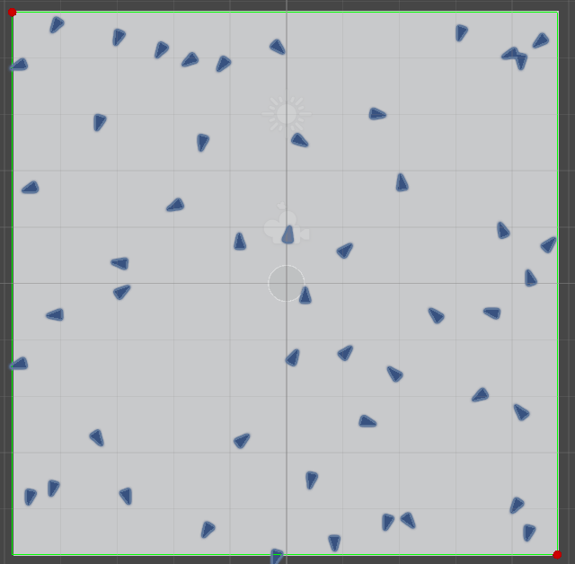
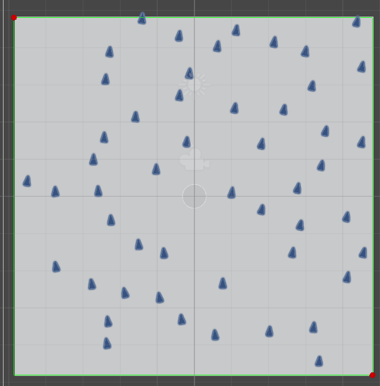

# Unity-ShaderLab

practice

2026

8.16

新建Odette文件夹，拆分并导入奥黛塔模型，连接纹理

新建Snow文件夹

8.17

在snowfield中添加了rendertexture的绘制和顶点偏移

8.18

增加了平面细分，添加了collider，尝试添加rt绘制mat失败

8.19

增加了根据高度图生成法线，光照效果似乎还存在一些问题；将凹陷shader逻辑和之前的亮片、基础色shader整合。

8.20

SF:rt绘制添加了mat参数，手写unlit可以正常处理透明度，shadergraph的mat仍然不行。

8.21
NC:导入荧模型，添加lambert光照

8.22
NC:添加LightMap

8.23
NC:添加基本Ramp采样

8.24
IG:微调视差逻辑，支持仅双层叠加

8.25
NC:赶进度，SDF报错

8.26
NC:添加LightMap.a选择ramp贴图行；修复repeat采样、mipmap设置带来的效果问题。

8.27
NC:添加sdf面部阴影（还没搞懂）

8.28
NC:添加阴影投射，但投射的骨骼阴影

8.29
NC:添加Furina；裙背面渲染

8.30
IG:v2 重新分析原神至冬冰面解决方案；在blender摄制图像序列导入unity作为3d纹理
IG:v2 新建代码shader，添加MainTex和法线贴图采样；

8.31
IG:v2 添加lambert漫反射、高光

9.1
IG:尝试采样CameraOpaqueTexture，失败

9.2
新建FireEffect
FE:粒子效果制作卡通火焰

9.3
新建SE
SE:简易snow粒子系统，相机跟随，视角转动无法跟随

9.4
迁入VolumeCloud、GrassTerrain

9.5
VC:添加射线探测球形渲染shader

9.6
VC:添加支持VolumeMap的射线探测shader

9.7
VC:添加支持光照的射线探测shader；光照计算存在部分问题尚未定位

9.8

VC:添加draknessThreadShold阴影钳制；添加暴露调参接口
VC:修复光照方向问题，居然是cuntomfunction类型配置错误！

9.9

VC:
添加Noise,乘Density输入模拟风对云的扰动：目前在片元着色器通过立方体uv采样噪声，存在接缝

9.10

Boid2:
添加boids生成、随机散布

Boid2:
为Boids添加“分离”能力!
(角度转换问题排查了好久QAQ)；
转向速度受到离自己最近物体的距离影响

9.11

Boid2:

重构了boids脚本结构：将分离、对齐、聚合分离为三个函数，统一进Observe函数，三个函数对总方向的影响更清晰，更易于调整；

为Boids添加“对齐”能力；
为Boids添加"聚合"能力！

9.12

Boid2:
为Boid Observe函数添加viewDistance的范围剔除；
调整分离、对齐、聚合的整合逻辑：用加权求和。权重变量统一在Creator对象管理，支持实时调整。
